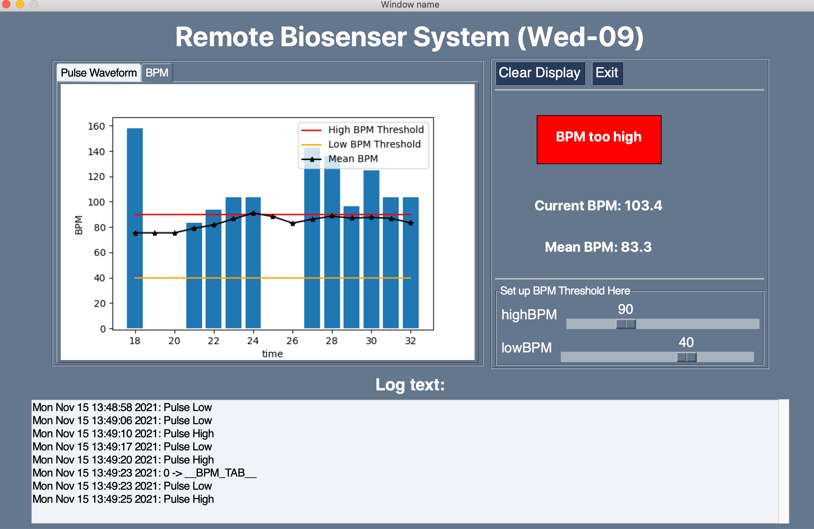

## Welcome to the program design for Remote Biosensor system !

 

This is the main task for BMET2922, done by group Wed-09, Yunyao Duan and Jacinta Cleary.

This program support us to measure and display your pulse through a pulse sensor, via Blutooth.

 

<!--  -->
<!--  -->

 

__To test the program, please download all the files, and run the `"pulseHost.py"` file__

 

Once you run the main test file, you will see a GUI. When you put your finger onto the pulse sensor, you will see your pulse waveform displayed in the GUI

 

We also provide BPM display, __to change the data type to display, please select the data type at the left-up cornor__

 

If your BPM abnormal, both graphicall and text alarm will be displayed. The graphical is displayed in the right-center of the GUI, red means your BPM is too high, orange means your BPM is too low, green means your BPM is normal

  

The default high and low BPM thresholds are 90 and 40, __you can manually set up the thresholds by using the sliders at the right-bottom of the GUI__

 

All the state changes (change of the tabs, change of the thresholds) and alarms wil be displayed in the logtext window.

 

__To test the program with some manually generated error, please push the swiches on the hardware__

- __Switch 1__: push to restart the uC
- __Switch 2__: 
    - push for the 1st time, to suspend comms
    - push for the 2nd time, to resume commes
    - push for the 3rd time, to cause a single sequence number error
    - push for the 4th time, to cause a single checksum error
